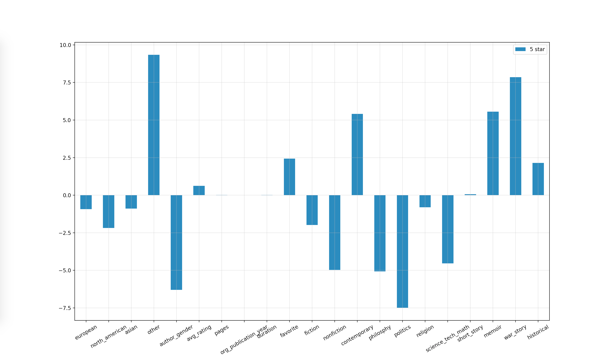

# BookAnalysis
An analysis of my reading habits from Oct. 2015. Exported using Goodreads.com

## Methods

Organize data in machine-readable csv. The columns were selected from the information given by Goodreads.com, in addition to columns supplied by me.

| five_star | european | north_american | asian | other | author_gender | avg_rating | pages | org_publication_year | duration | favorite |
| :------------ | :------------ | :------------ | :------------ | :------------ | :------------ | :------------ | :------------ | :------------ | :------------ | :------------ |
| 1: five star book  | 1: eurpoean author  |  1: north american author | 1: asian author  | 1: author of other country  | 1: female  | Goodreads rating  |  number of pages | original publication year  | days to finish book  |  1: favorite book |

|fiction |nonfiction|contemporary|philosophy|politics|religion|science_tech_math|short_story|memoir|war_story|historical|
| :------------ | :------------ | :------------ | :------------ | :------------ | :------------ | :------------ | :------------ | :------------ | :------------ | :------------ |
|1: fiction book|1:non-fiction book|1:contemporary (last 20-30 years, depending on writing style)|1: philosophy book|1:political book|1:religious book|1:science, technology, or mathematics book|1:composed of short stories|1: memoir|1: war story|1:historical fiction (or non-fiction based on history)|

Iterated 250 over increments of 1/25 of the training/testing cutoff to determine the best training/testing ration: 0.76-0.80.

Utilize a binary logistic regression model to fit the factors. Target factor is *five_star*, hence why the first data row has that column left blank (for single book testing).

## Results

The most significant flaw in this design is the lack of data. Insufficient data causes this implementation to act inconsistent when determining the model's coefficients. Must mean I need to read more!
